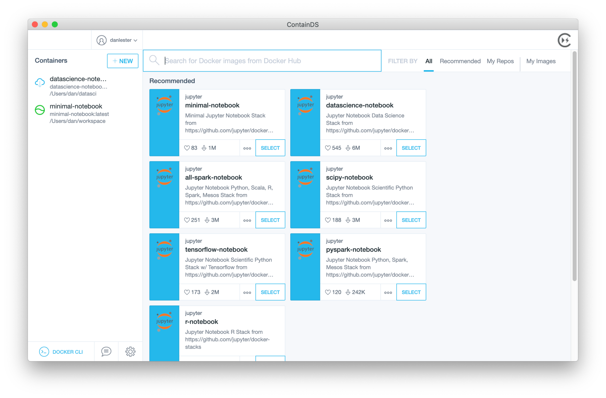
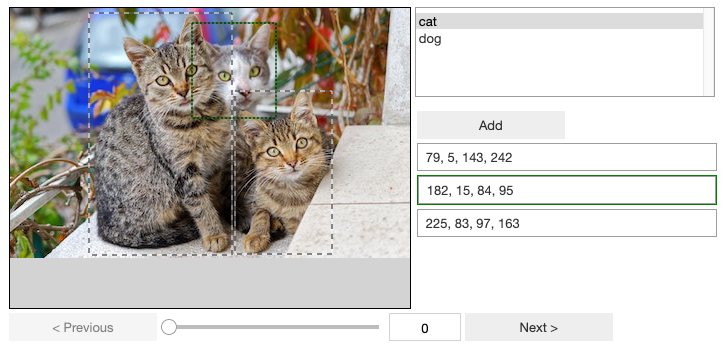
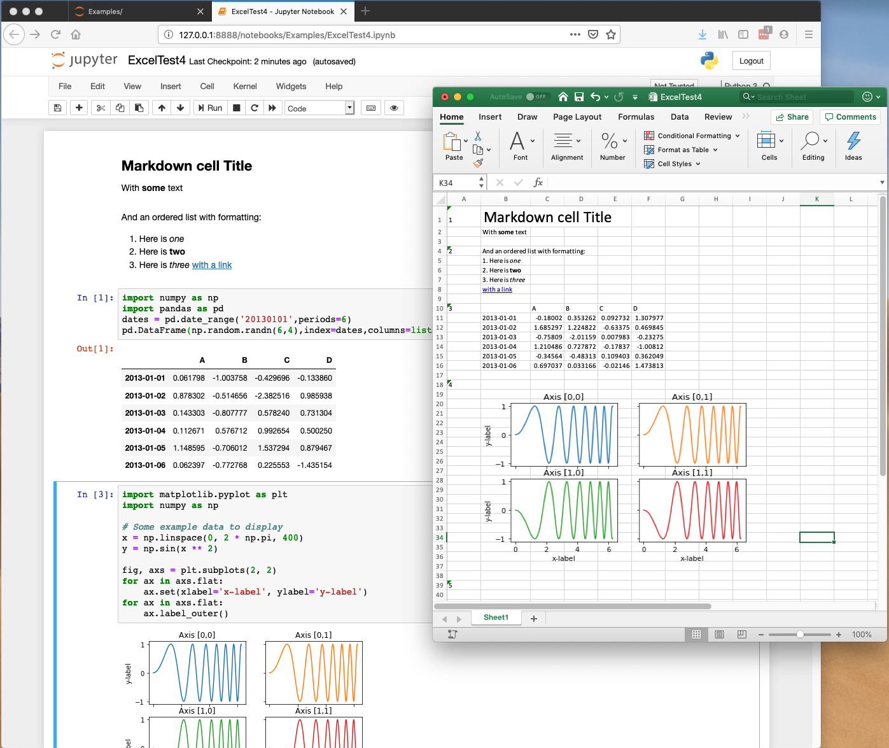

Software products for Data Scientists

## ContainDS

A simple user interface allowing you to easily run Jupyter Lab or Notebooks through virtual environments on your Windows or Mac computer.

Launch a Binder-ready git repository on your local machine.

[See more details on containds.com](https://containds.com/)

## Jupyter Innotater

Annotate data including image bounding boxes inline within your Jupyter notebook in Python. Innotater's flexible API allows easy selection of interactive controls to suit your datasets exactly.

Now works with Jupyter Lab (1.0+)

[View on GitHub here](https://github.com/ideonate/jupyter-innotater)

## nb2xls - Jupyter notebooks to Excel Spreadsheets

Convert Jupyter notebooks to Excel Spreadsheets (xlsx), through a new 'Download As' option or via nbconvert on the command line.

Respects markdown and tables such as Pandas DataFrames. Also exports image data such as matplotlib output.

This allows you to share your results with non-programmers such that they can still easily play with the data.

[View on GitHub here](https://github.com/ideonate/nb2xls)

## Contact us

[contact@ideonate.com](mailto:contact@ideonate.com)
